```mermaid
flowchart TB
    subgraph Entry["Entry Points"]
        AppLaunch["App Launch / Pull to Refresh<br/><i>HomeView.task / .refreshable</i>"]
        FirstPermission["First Permission Grant<br/><i>CategoryDetailView</i>"]
    end

    subgraph MonolithRefresh["Monolith Refresh Function<br/><i>HomeView.refresh()</i>"]
        GuardRefresh{"isRefreshing?"}
        CheckAI["checkAvailability()<br/><i>FoundationModelService</i>"]
        TaskGroup["withTaskGroup<br/><i>Dispatch 5 category tasks</i>"]
    end

    subgraph CategoryTasks["Concurrent Category Tasks (×5)"]
        direction LR
        HeartTask["Heart"]
        SleepTask["Sleep"]
        MindfulTask["Mind"]
        PerfTask["Perf"]
        VitalTask["Vital"]
    end

    subgraph SingleCategoryFlow["Per-Category Flow<br/><i>HealthService.refreshCategory()</i>"]
        CheckAuth{"Authorized?"}
        SkipCategory["Skip category"]
    end

    subgraph CacheCheck["Cache Check<br/><i>HealthCache.getTimespanSummary()</i>"]
        CacheHit{"Cache fresh?<br/><i>daily/weekly/monthly rules</i>"}
        ReturnCached["Return cached summary"]
    end

    subgraph HealthKitFetch["HealthKit Fetch<br/><i>HealthFetcher</i>"]
        FetchData["fetchHeartData()<br/><i>async let for each metric</i>"]
        HKQuery["HKStatisticsQuery"]
    end

    subgraph AIProcessing["AI Summary<br/><i>FoundationModelService</i>"]
        CheckHasData{"Has data?"}
        NoDataSummary["noData summary"]
        CheckiOS26{"iOS 26+?"}
        LLMGenerate["LanguageModelSession"]
        FallbackGenerate["fallbackSummary"]
    end

    subgraph CacheSave["Cache Save<br/><i>HealthCache (actor-isolated)</i>"]
        SaveToCache["saveTimespanSummary()<br/><i>Core Data context.save()</i>"]
    end

    subgraph UIUpdate["UI Update (Main Thread)"]
        UpdateUI["@MainActor callback"]
        UpdateHome["Update HomeView tile"]
        CheckDetailOpen{"Detail open?"}
        UpdateDetail["Update CategoryDetailView"]
    end

    subgraph FirstPermissionFlow["First Permission Edge Case"]
        RequestAuth["requestAuthorization()"]
        AuthDialog["HealthKit Dialog"]
        SingleRefresh["refreshCategory()<br/><i>Single category only</i>"]
    end

    %% Main flow
    AppLaunch --> GuardRefresh
    GuardRefresh -->|"Already refreshing"| GuardRefresh
    GuardRefresh -->|"Start refresh"| CheckAI
    CheckAI --> TaskGroup
    TaskGroup --> HeartTask & SleepTask & MindfulTask & PerfTask & VitalTask

    %% Category task flow
    HeartTask & SleepTask & MindfulTask & PerfTask & VitalTask --> CheckAuth
    CheckAuth -->|No| SkipCategory
    CheckAuth -->|Yes| CacheHit

    %% Cache decision
    CacheHit -->|Fresh| ReturnCached
    CacheHit -->|Stale| FetchData

    %% HealthKit fetch
    FetchData --> HKQuery
    HKQuery --> CheckHasData

    %% AI processing
    CheckHasData -->|No| NoDataSummary
    CheckHasData -->|Yes| CheckiOS26
    CheckiOS26 -->|Yes| LLMGenerate
    CheckiOS26 -->|No| FallbackGenerate

    %% Save and update
    LLMGenerate --> SaveToCache
    FallbackGenerate --> SaveToCache
    SaveToCache --> UpdateUI
    ReturnCached --> UpdateUI
    NoDataSummary --> UpdateUI

    %% UI updates
    UpdateUI --> UpdateHome
    UpdateUI --> CheckDetailOpen
    CheckDetailOpen -->|Yes| UpdateDetail

    %% First permission flow
    FirstPermission --> RequestAuth
    RequestAuth --> AuthDialog
    AuthDialog --> SingleRefresh
    SingleRefresh --> CacheHit

    %% Styling - High contrast colors for light/dark backgrounds
    classDef entryPoint fill:#4FC3F7,stroke:#0277BD,stroke-width:2px,color:#000
    classDef service fill:#BA68C8,stroke:#6A1B9A,stroke-width:2px,color:#000
    classDef cache fill:#FFB74D,stroke:#E65100,stroke-width:2px,color:#000
    classDef ui fill:#81C784,stroke:#2E7D32,stroke-width:2px,color:#000
    classDef decision fill:#FFF176,stroke:#F9A825,stroke-width:2px,color:#000
    classDef healthkit fill:#EF5350,stroke:#B71C1C,stroke-width:2px,color:#fff
    classDef ai fill:#7986CB,stroke:#303F9F,stroke-width:2px,color:#000

    class AppLaunch,FirstPermission entryPoint
    class CheckAI,CheckAuth,FetchData service
    class CacheHit,ReturnCached,SaveToCache cache
    class UpdateUI,UpdateHome,UpdateDetail ui
    class GuardRefresh,CheckHasData,CheckiOS26,CheckDetailOpen decision
    class HKQuery healthkit
    class LLMGenerate,FallbackGenerate,NoDataSummary ai
```

## Legend

| Color | Meaning |
|-------|---------|
| 🔵 Cyan | Entry points |
| 🟣 Purple | Service layer |
| 🟠 Orange | Cache (Core Data) |
| 🟢 Green | UI updates (@MainActor) |
| 🟡 Yellow | Decision points |
| 🔴 Red | HealthKit queries |
| 🔷 Indigo | AI/Foundation Model |

## Key Files

| File | Role |
|------|------|
| `HomeView.swift` | `refresh()` - unified monolith entry for launch + pull-to-refresh |
| `CategoryDetailView.swift` | `requestPermissionsAndRefresh()` - first permission edge case |
| `HealthService.swift` | `refreshCategory()`, `fetchTimespanSummaries()` - orchestration |
| `HealthFetcher.swift` | `fetchHeartData()` - HealthKit queries |
| `HealthCache.swift` | `getTimespanSummary()`, `saveTimespanSummary()` - Core Data |
| `FoundationModelService.swift` | `generateSummary()` - LLM or fallback |

## Cache Freshness Rules

| TimeSpan | Update Frequency |
|----------|------------------|
| Daily | Every day |
| Weekly | Every 3 days |
| Monthly | Once a week |

## Key Design Decisions

1. **Unified entry point**: App launch and pull-to-refresh use the same `refresh()` function
2. **isRefreshing guard**: Prevents concurrent refresh races
3. **Cache-first**: Always check cache before fetching - fast perceived startup
4. **Progressive UI**: Each category updates independently as it completes
5. **Actor isolation**: `HealthService` is an actor, `HealthCache` uses Core Data context for thread safety
6. **First permission edge case**: Only refreshes the single category, not the full monolith